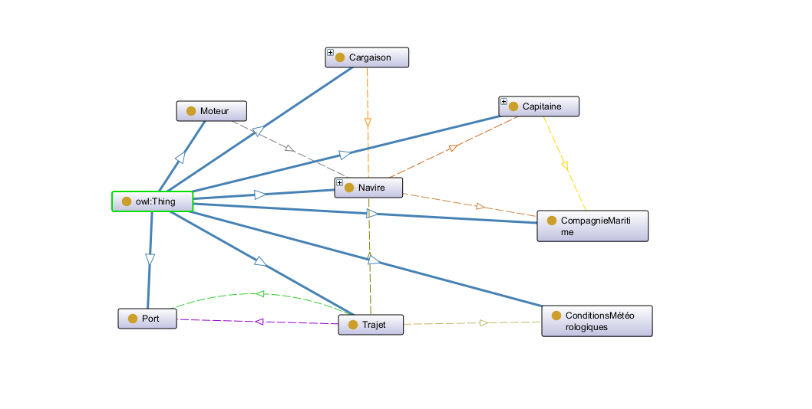

# 🚢 __Ontologie du Transport Maritime__ 

Mini-projet réalisé par [**Ahmad Chakcha**](https://github.com/AhmadChakcha) et [**Mohamed Ali Djemal**](https://github.com/chameauu)  dans le cadre du cours sur les Technologies Sémantiques. L'objectif est de modéliser les concepts et relations du **Transport Maritime** en utilisant les standards du web sémantique (RDF, RDFS, SPARQL, OWL,SWRL).

## 🌊 Présentation  :

Le transport maritime est un secteur vital qui relie les continents en transportant les  marchandises  par voie marine.  Représentant **90%** du commerce mondial, il joue un rôle essentiel dans l'économie globale.  
  
Ce projet se concentre sur ce domaine afin d'explorer comment le web sémantique peut aider à structurer et gérer les données liées aux navires, ports, trajets et compagnies maritimes.

***🔑 Concepts Clés:***   

+ *Navires* :  
    Les bateaux utilisés pour transporter des marchandises.  

+ *Compagnies maritimes* :  
    Les entreprises qui gèrent et exploitent les navires pour le transport.  

+ *Cargaison* :  
    Les marchandises transportées par les navires.  

+ *Ports*:  
    Les infrastructures où les navires arrivent pour embarquer ou débarquer des marchandises.  

+ *Trajets*:  
    Parcours effectué par un navire entre deux ports.  

+ *Capitaine* :  
    La personne responsable de la gestion et de la navigation d'un navire. 

## 🌊 Modélisation en RDF / RDFS :  

Voici un aperçu des parties principales de ce Mini-Projet  pour mieux s’y retrouver.

- **Classes**
- **Propriétés de données**
- **Propriétés d’objet**

### 🧩 Classes :
Les classes  utilisés dans l’ontologie sont :

 🏷️ ConditionsMétéorologiques

🏷️ Moteur

🏷️ Capitaine

🏷️ Cargaison

🏷️ CompagnieMaritime

🏷️ Navire

🏷️ Port

🏷️Trajet

### 🧩 Propriétés de données : 

Les propriétés de données sont listées ci-dessous pour chaque classe :

- _ConditionsMétéorologiques_ :
  - Température
  - Visibilité
  - VitesseVent

- _Moteur_ :
  - IdMoteur
  - TypeMoteur
  - Puissance
  - Consommation

- _Capitaine_ :
  - IdCapitaine
  - NomCapitaine
  - PrénomCapitaine
  - Salaire
  - Âge
  - DateDébutTravail
  - Nationalité

- _Cargaison_ :
  - IdCargaison
  - Poids
  - Prix
  - TypeCargaison

- _CompagnieMaritime_ :
  - IdCompanie
  - NomCompanie
  - NombreNavire
  - ChiffresAffaires
  - AnnéeCréation

- _Navire_ :
  - IdNavire
  - AnnéeConstruction
  - Capacité
  - Longueur
  - Largeur
  - TypeNavire 

- _Port_ :
  - IdPort
  - NomPort
  - CapacitéPort
  - Location

- _Trajet_ :
  - IdTrajet
  - Distance
  - Durée
  - DateArrivée
  - DateDépart

### 🧩 Propriétés d’objet :  
Les propriétés d’objet représentant les relations entre les différentes classes de l’ontologie :  

- *appartientÀ* : 
  -  Indique qu’un **Navire** appartient à une **CompagnieMaritime**.  

- *commandéPar* :
  - Montre quel **Capitaine** est responsable d’un **Navire**.

- *employéPar* : 
  -  Spécifie la **CompagnieMaritime** qui emploie un **Capitaine**.

- *transportéPar* :
  - Fait le lien entre une **Cargaison** et le **Navire**.

- *depuisPort* :
  - Désigne le **Port** de départ d’un **Trajet**.

- *versPort* :
  - Représente le **Port** d’arrivée d’un **Trajet** . 

- *utiliséPar* :
  -  Le **Moteur** utilisé par un **Navire**.

- *effectuéPar* : 
  - Indique qu’un **Trajet** est effectué par un **Navire**.

- *affectéPar* :
  - Indique qu’un  **Trajet** est influencé par les **ConditionsMétéorologiques** . 

### 🗺️ Visualisation de l'ontologie :  

Voici une représentation visuelle de l'ontologie du transport maritime :  

## 🌊 Interrogation avec SPARQL :  
Voici quelques requêtes SPARQL utilisées pour interroger une base de données RDF sur le transport maritime.  

#### 🔍 Requête 1 : Informations sur les capitaines :  

    PREFIX : <http://www.semanticweb.org/transportmaritime#>
    SELECT  ?id  ?prenom ?nom  ?nationalite ?salaire
    WHERE {
    ?capitaine :NomCapitaine ?nom ;
             :Salaire ?salaire ;
             :IdCapitaine ?id ;
             :PrénomCapitaine ?prenom;
             :Nationalité ?nationalite .
          } 
  => Retourne l'identifiant, le prénom, le nom, la nationalité et le salaire de chaque capitaine.  
  
#### 🔍 Requête 2 : Types de cargaisons :  
    PREFIX : <http://www.semanticweb.org/transportmaritime#>
    SELECT DISTINCT ?type
    WHERE {
    ?cargaison :TypeCargaison ?type .
    }    
  => Retourne les types de cargaisons distincts présents dans la base.